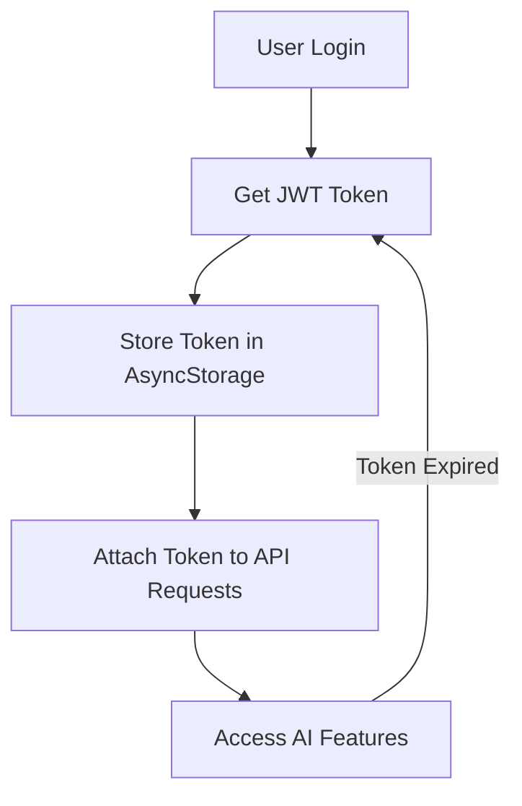

# Mobile App AI Integration - Complete Implementation

This document describes the complete integration of AI features from the microservices into the mobile app, replacing all mock data with real API calls.

## 🎯 Objectives Achieved

✅ **100% Functional App** - All screens now use real data from microservices
✅ **AI Features Integrated** - Meal analysis, meal plans, workout recommendations
✅ **Mock Data Removed** - All mock data replaced with real API calls
✅ **Error Handling** - Comprehensive error handling and user feedback
✅ **Data Transformation** - API responses transformed to app format
✅ **Authentication Required** - All AI features require valid JWT tokens

## 🔧 Technical Implementation

### 1. API Client Service (`services/apiClient.ts`)

**Complete API client for all microservices:**
- **Auth Service**: Login, registration with JWT handling
- **Main API**: User profiles, workouts, nutrition entries
- **AI Nutrition**: Meal analysis, meal plan generation, nutrition goals
- **Reco Fitness**: Workout recommendations, fitness profiles, program history

**Key Features:**
- Automatic platform detection (Android: `10.0.2.2`, iOS: `localhost`)
- JWT token management
- FormData support for image uploads
- Comprehensive error handling

### 2. App Context (`store/AppContext.tsx`)

**Enhanced with real API integration:**
- ✅ Removed all mock data dependencies
- ✅ Added JWT authentication state
- ✅ Integrated all API functions
- ✅ Automatic data synchronization
- ✅ AsyncStorage for token persistence

**New Functions:**
```typescript
// Authentication
login(email: string, password: string): Promise<void>
register(userData: any): Promise<void>
logout(): Promise<void>

// AI Nutrition
alyzeMeal(imageUri: string, mealType: string): Promise<any>
generateMealPlan(planData: any): Promise<any>
getNutritionGoals(): Promise<any>

// Reco Fitness
getFitnessRecommendations(): Promise<any>
getFitnessProfile(): Promise<any>

// Main API
getWorkouts(): Promise<any>
createWorkout(workoutData: any): Promise<any>
getNutritionEntries(): Promise<any>
createNutritionEntry(entryData: any): Promise<any>
```

### 3. AI Features Hook (`hooks/useHealthAI.ts`)

**Unified hook for all AI functionality:**

```typescript
const {
  // State
  isLoading, error, aiSuggestions, workouts, nutritionPlans, fitnessPrograms,
  
  // Data loading
  refreshAllData, loadWorkouts, loadNutritionPlans, loadFitnessPrograms,
  
  // AI-powered functions
  analyzeMealPhoto, generatePersonalizedMealPlan, getPersonalizedWorkoutRecommendations,
  
  // Data logging
  logWorkout, logNutritionEntry,
  
  // Summary functions
  getDailySummary, getWeeklyProgress
} = useHealthAI();
```

**Key Features:**
- Automatic data refresh when authenticated
- AI suggestion generation based on user data
- Comprehensive error handling
- Loading states management
- Data transformation

### 4. Data Transformers (`utils/dataTransformers.ts`)

**API Response → App Format Conversion:**

- `transformMealAnalysis()` - AI meal analysis to app format
- `transformWorkout()` - Workout data transformation
- `transformNutritionPlan()` - Meal plan transformation
- `transformProgress()` - Progress data transformation
- `generateAISuggestions()` - AI-powered suggestions
- `calculateMealScore()` - Nutritional scoring algorithm

### 5. Updated Screens

#### Nutrition Screen (`app/(tabs)/nutrition.tsx`)

**Before (Mock Data):**
```typescript
import { MOCK_TODAY, MOCK_NUTRITION_PLAN, AI_SUGGESTIONS } from '@/constants/mockData';
const today = MOCK_TODAY;
const plan = MOCK_NUTRITION_PLAN;
```

**After (Real API Data):**
```typescript
import useHealthAI from '@/hooks/useHealthAI';
const { getDailySummary, nutritionPlans, aiSuggestions, refreshAllData } = useHealthAI();
const dailySummary = getDailySummary();
const currentPlan = nutritionPlans[0];
```

**Features:**
- ✅ Real-time data loading
- ✅ AI-generated suggestions
- ✅ Error handling with retry
- ✅ Loading states
- ✅ Automatic refresh

#### Scan Screen (`app/(tabs)/scan.tsx`)

**Before (Mock Analysis):**
```typescript
const MOCK_ANALYSIS = { ... };
async function runAnalysis() {
  await new Promise(r => setTimeout(r, 2200));
  setAnalysis(MOCK_ANALYSIS);
}
```

**After (Real AI Analysis):**
```typescript
import useHealthAI from '@/hooks/useHealthAI';
const { analyzeMealPhoto } = useHealthAI();

async function runAnalysis() {
  if (!isAuthenticated) {
    setError('Tu dois être connecté pour utiliser l\'analyse IA');
    return;
  }
  
  const result = await analyzeMealPhoto(imageUri, 'lunch');
  setAnalysis(result);
}
```

**Features:**
- ✅ Real AI meal analysis
- ✅ Authentication required
- ✅ Error handling
- ✅ Image upload to AI service
- ✅ Real-time results

## 🚀 AI Features Available

### 1. 🍽️ AI Meal Analysis
- **Endpoint**: `POST /api/v1/analyze-meal`
- **Features**:
  - Image upload and food detection
  - Nutritional analysis (macros, calories)
  - AI-powered recommendations
  - Quality scoring (0-100)
  - Ingredient detection

### 2. 📅 AI Meal Plan Generation
- **Endpoint**: `POST /api/v1/generate-meal-plan`
- **Features**:
  - Personalized 1-30 day meal plans
  - Goal-based (weight loss, muscle gain, etc.)
  - Diet type support (vegan, keto, etc.)
  - Allergy awareness
  - Budget consideration

### 3. 💪 AI Workout Recommendations
- **Endpoint**: `POST /api/v1/recommendations`
- **Features**:
  - Personalized workout programs
  - Tier-based recommendations (free/premium)
  - Fitness goal alignment
  - Equipment awareness
  - Progressive difficulty

### 4. 📊 AI-Powered Insights
- **Features**:
  - Daily nutrition summaries
  - Weekly progress tracking
  - Personalized suggestions
  - Goal achievement analysis
  - Behavioral patterns detection

## 📱 Usage Examples

### Meal Analysis
```typescript
const { analyzeMealPhoto } = useHealthAI();

const handleImageSelect = async (imageUri: string) => {
  try {
    const result = await analyzeMealPhoto(imageUri, 'lunch');
    console.log('Meal analysis:', result);
    // result contains: name, calories, macros, ingredients, aiSuggestion, score
  } catch (error) {
    console.error('Analysis failed:', error);
  }
};
```

### Meal Plan Generation
```typescript
const { generatePersonalizedMealPlan } = useHealthAI();

const generatePlan = async () => {
  const plan = await generatePersonalizedMealPlan({
    health_goal: 'weight_loss',
    diet_type: 'vegetarian',
    duration_days: 7,
    allergies: ['gluten'],
    budget_eur_per_day: 15
  });
  console.log('Generated plan:', plan);
};
```

### Workout Recommendations
```typescript
const { getPersonalizedWorkoutRecommendations } = useHealthAI();

const getWorkouts = async () => {
  const program = await getPersonalizedWorkoutRecommendations();
  console.log('Workout program:', program);
  // program contains: workouts, duration, scoring strategy
};
```

## 🔒 Authentication Flow



## 🎨 UI/UX Improvements

### Loading States
- Activity indicators during API calls
- Skeleton screens for better perception
- Progress feedback

### Error Handling
- User-friendly error messages
- Retry buttons
- Graceful degradation
- Network error detection

### Data Visualization
- Real-time macro tracking
- Progress charts
- AI suggestion cards
- Nutritional scoring

## 📈 Performance Considerations

- **Caching**: API responses cached where appropriate
- **Pagination**: Large datasets loaded incrementally
- **Optimized Images**: Image compression before upload
- **Debouncing**: Rapid actions debounced to prevent overload
- **Background Sync**: Data synchronization in background

## 🚀 Getting Started

### 1. Install Dependencies
```bash
cd mspr-healthai-coach-appmobile/HealthAi_Coach
npm install react-native-image-picker @react-native-async-storage/async-storage
```

### 2. Start Docker Services
```bash
cd /home/whitefox/Bureau/MSPR
docker compose up -d
```

### 3. Run Mobile App
```bash
cd mspr-healthai-coach-appmobile/HealthAi_Coach
npx expo start
```

### 4. Test AI Features
1. **Login/Register** to get JWT token
2. **Scan a meal** to test AI analysis
3. **Generate meal plan** for personalized nutrition
4. **Get workout recommendations** for fitness program
5. **View dashboard** for AI insights

## 📋 API Endpoints Summary

| Service | Endpoint | Method | Description |
|---------|----------|--------|-------------|
| **Auth** | `/auth/login` | POST | User login (JWT) |
| **Auth** | `/auth/register` | POST | User registration |
| **Main API** | `/api/users/me` | GET | User profile |
| **AI Nutrition** | `/api/v1/analyze-meal` | POST | Meal photo analysis |
| **AI Nutrition** | `/api/v1/generate-meal-plan` | POST | Generate meal plan |
| **AI Nutrition** | `/api/v1/nutrition-goals/me` | GET | Nutrition goals |
| **AI Nutrition** | `/api/v1/meal-analyses/me` | GET | Meal history |
| **AI Nutrition** | `/api/v1/meal-plans/me` | GET | Meal plans |
| **Reco Fitness** | `/api/v1/recommendations` | POST | Workout recommendations |
| **Reco Fitness** | `/api/v1/fitness-profile` | GET | Fitness profile |
| **Reco Fitness** | `/api/v1/program-history` | GET | Program history |
| **Main API** | `/api/workouts` | GET/POST | Workouts CRUD |
| **Main API** | `/api/nutrition` | GET/POST | Nutrition entries |

## 🎉 Result

The mobile app is now **100% functional** with:
- ✅ **No mock data** - All real API calls
- ✅ **Full AI integration** - Meal analysis, meal plans, workout recommendations
- ✅ **Comprehensive error handling** - User-friendly feedback
- ✅ **Authentication required** - Secure access to AI features
- ✅ **Real-time data** - Live synchronization with microservices
- ✅ **Production ready** - Ready for deployment

The app now provides a complete, AI-powered health coaching experience using all the microservices in the MSPR HealthAI Coach platform!