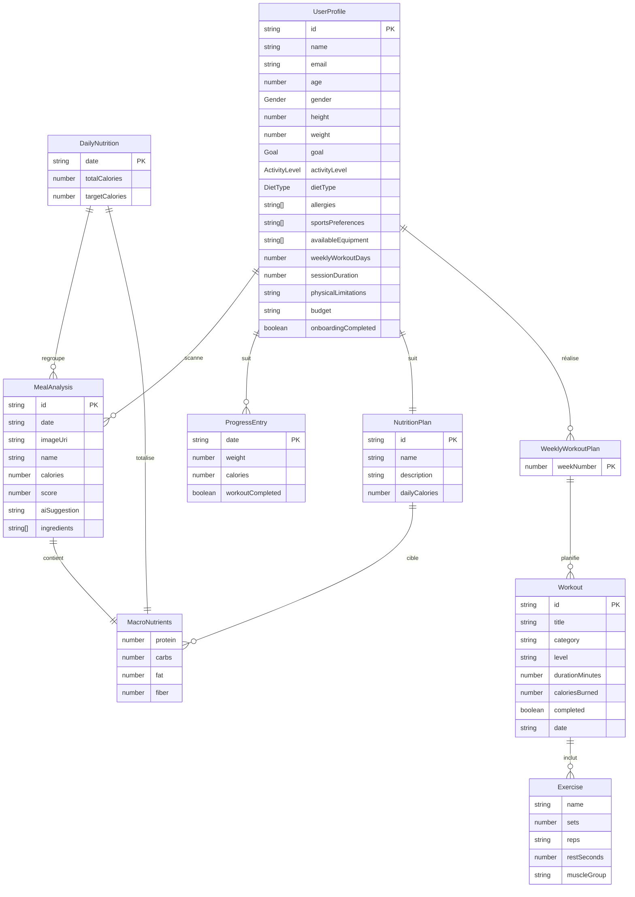
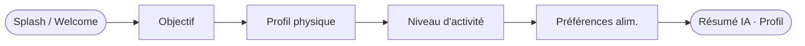
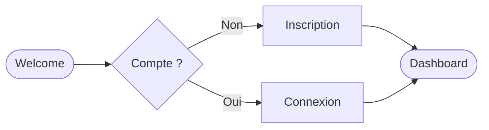
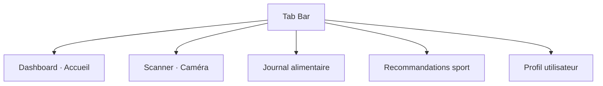
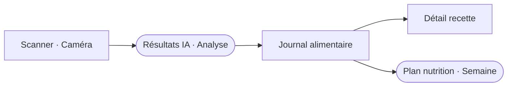
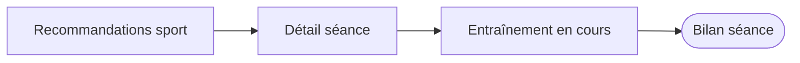
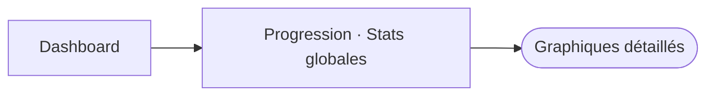
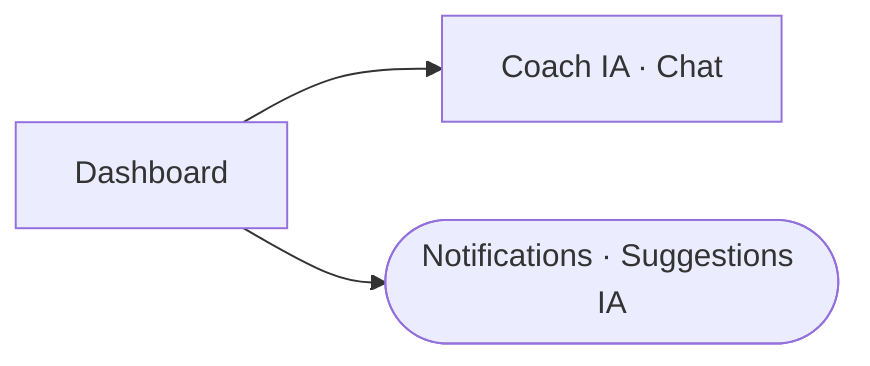
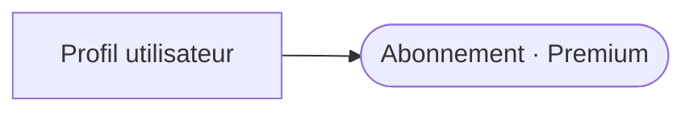

<div align="center">

# HealthAI Coach

**Application mobile de coaching santé & nutrition personnalisé par l'IA**

[](https://expo.dev)
[](https://reactnative.dev)
[](https://www.typescriptlang.org)
[](#)

</div>

---

## Présentation

**HealthAI Coach** est une application mobile cross-platform (iOS / Android) qui accompagne l'utilisateur dans l'atteinte de ses objectifs santé grâce à l'intelligence artificielle. Elle propose une analyse nutritionnelle par scan de repas, un coach sportif personnalisé, un suivi de progression et un assistant conversationnel.

### Fonctionnalités principales

| Module | Description |
|---|---|
| **Onboarding IA** | Configuration du profil, objectifs, préférences alimentaires & sportives |
| **Scanner de repas** | Analyse caloriques & macros par photo via IA |
| **Plan nutrition** | Programme alimentaire hebdomadaire adaptatif |
| **Coach sport** | Séances personnalisées avec suivi en temps réel |
| **Progression** | Statistiques, graphiques et bilan global |
| **Coach IA** | Assistant conversationnel intelligent |

---

## Stack technique

| Couche | Technologie |
|---|---|
| Framework | Expo 54 + React Native 0.81 |
| Navigation | Expo Router 6 (file-based routing) |
| Langage | TypeScript 5.9 |
| State management | React Context + AsyncStorage |
| Animations | React Native Reanimated 4 |
| Graphiques | React Native SVG |
| Gradients | Expo Linear Gradient |
| Médias | Expo Image Picker |
| UI | Composants custom (design system interne) |

---

## Architecture du projet

```
HealthAi_Coach/
├── app/
│   ├── (auth)/             # Authentification
│   │   ├── welcome.tsx
│   │   ├── login.tsx
│   │   └── register.tsx
│   ├── (onboarding)/       # Configuration profil
│   │   ├── goal.tsx
│   │   ├── physical.tsx
│   │   ├── activity.tsx
│   │   ├── diet.tsx
│   │   └── sport-prefs.tsx
│   └── (tabs)/             # App principale
│       ├── index.tsx        # Dashboard
│       ├── scan.tsx         # Scanner IA
│       ├── nutrition.tsx    # Nutrition
│       ├── sport.tsx        # Sport
│       └── profile.tsx      # Profil
├── components/
│   └── ui/                 # Composants réutilisables
├── constants/
│   ├── theme.ts            # Design system (Midnight Health)
│   └── mockData.ts
├── store/
│   └── AppContext.tsx       # State global
├── types/
│   └── index.ts            # Types TypeScript
└── assets/
    └── design/
        ├── design-system.html
        └── wireframes.html
```

---

## MCD — Modèle Conceptuel de Données



---

## Flows & Maquettes

> Wireframes complets (24 écrans) → [`assets/design/wireframes.html`](assets/design/wireframes.html)  
> Design system complet → [`assets/design/design-system.html`](assets/design/design-system.html)

### Flow 01 — Onboarding



### Flow 02 — Authentification



### Flow 03 — App principale



### Flow 04 — Nutrition & Analyse IA



### Flow 05 — Sport & Entraînement



### Flow 06 — Progression & Statistiques



### Flow 07 — Coach IA & Notifications



### Flow 08 — Profil & Paramètres



---

## Thème — Midnight Health

Design system sombre orienté premium santé.

| Token | Valeur | Usage |
|---|---|---|
| `background` | `#0F1117` | Fond principal |
| `surface` | `#1A1D27` | Cartes, modales |
| `surface2` | `#1F2333` | Éléments secondaires |
| `acid` | `#FF6B35` | Couleur brand, CTA |
| `acidDark` | `#E55A25` | États actifs |
| `text` | `#E8E9F0` | Texte principal |
| `textSecondary` | `#9DA3B4` | Texte secondaire |
| `success` | `#22C55E` | Validations |
| `error` | `#EF4444` | Erreurs |
| `sky` | `#38BDF8` | Accent bleu |
| `mint` | `#2DD4BF` | Accent vert |

---

## Installation & Démarrage

### Prérequis

- Node.js ≥ 18
- npm ≥ 9
- Expo CLI : `npm install -g expo-cli`
- Expo Go sur iOS ou Android (pour tester sur device)

### Installation

```bash
git clone <repo-url>
cd HealthAi_Coach
npm install
```

### Lancer le projet

```bash
# Serveur de développement
npm start

# Android
npm run android

# iOS
npm run ios

# Web
npm run web
```

### Vérifications qualité

```bash
# Lint + TypeCheck
npm test

# TypeCheck seul
npm run typecheck

# Lint seul
npm run lint
```

---

## Contributeurs

| Nom | Rôle |
|---|---|
| HealthAI Global Team | Développement & Design |

---

<div align="center">

**HealthAI Coach** — MSPR HealthAI · 2026

</div>
